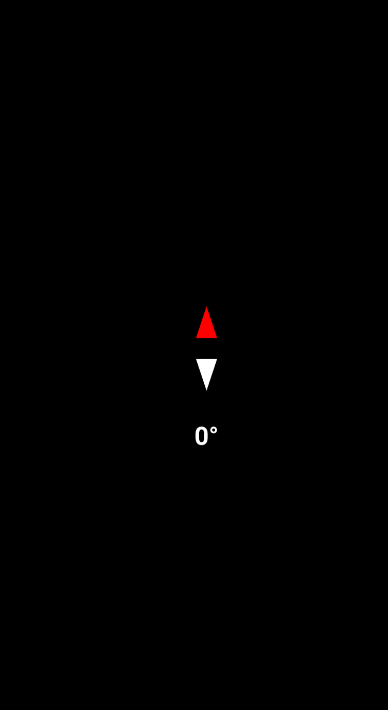

# Compass App 🧭

I developed a simple Android app in Android Studio that utilizes the phone’s magnetometer and accelerometer to function as a digital compass. When the app launches, it displays an arrow that dynamically rotates to always point north, along with a real-time heading in degrees. Here is how I created it:




## **Getting Started**


To develop this app, you’ll need Android Studio, which you can download from the [official site](https://developer.android.com/studio). Install and set up the IDE following the instructions for your operating system. A physical Android device is recommended for testing since the app relies on the magnetometer and accelerometer sensors. Make sure to enable Developer Mode and USB Debugging in your device settings.

If you do have to use an emualtor, I found that rotating the emualtor screen still allows the compass to dynamically rotate similiar to a real compass. However, the reading will still display 0 degrees.


## **Creating the App**

### Preamble

The first step is to create a new project in Android Studio. Open the IDE and select "Create New Project." Choose "Empty Activity" as the template, then configure the project:

- Project Name: Cardinal
- Language: Kotlin
- Minimum SDK: Select a version that supports most devices (e.g., API 21 or higher).
- Click "Finish" to generate the project files.

---

### **Modifying the Main Class**  

Since the `MainActivity` file wasn’t automatically created, I manually added it inside the `com.example.cardinal` package.  


#### **Overview of MainActivity Code**  
The `MainActivity.kt` file contains the core logic for handling **sensor input** and updating the **compass needle** dynamically. Here is the Breakdown:  

1. **Imports & Class Definition**  
   - Imports necessary Android sensor classes.  
   - Defines `MainActivity` as an `AppCompatActivity`, implementing `SensorEventListener` to receive sensor updates.  

2. **Initializing the Sensors**  
   - Uses `SensorManager` to access the **magnetometer** and **accelerometer**, which together determine the device’s orientation.  
   - Registers the sensors in `onResume()` and unregisters them in `onPause()` for battery optimization.  

3. **Handling Sensor Data**  
   - The `onSensorChanged()` method listens for updates and calculates the **azimuth (angle relative to North)** using sensor readings.  
   - The compass **needle (`ImageView`) rotates dynamically** based on the azimuth value.  
   - Updates a `TextView` to display the **current heading in degrees**.  


#### **Main Class Code (`MainActivity.kt`)**
```kotlin
package com.example.cardinal
import android.content.Context
import android.hardware.Sensor
import android.hardware.SensorEvent
import android.hardware.SensorEventListener
import android.hardware.SensorManager
import android.os.Bundle
import android.view.animation.Animation
import android.view.animation.RotateAnimation
import android.widget.ImageView
import android.widget.TextView
import androidx.appcompat.app.AppCompatActivity
import androidx.compose.ui.input.key.type
import androidx.compose.ui.layout.layout
import androidx.compose.ui.semantics.text
import com.example.cardinal.R
import kotlin.math.roundToInt


class MainActivity : AppCompatActivity(), SensorEventListener {

    private lateinit var sensorManager: SensorManager
    private var accelerometerSensor: Sensor? = null
    private var magneticFieldSensor: Sensor? = null
    private lateinit var compassNeedle: ImageView
    private lateinit var headingTextView: TextView
    private var currentDegree = 0f

    private var gravity = FloatArray(3)
    private var geomagnetic = FloatArray(3)

    override fun onCreate(savedInstanceState: Bundle?) {
        super.onCreate(savedInstanceState)
        setContentView(R.layout.activity_main)

        compassNeedle = findViewById(R.id.compassNeedle)
        headingTextView = findViewById(R.id.headingTextView)

        sensorManager = getSystemService(Context.SENSOR_SERVICE) as SensorManager
        accelerometerSensor = sensorManager.getDefaultSensor(Sensor.TYPE_ACCELEROMETER)
        magneticFieldSensor = sensorManager.getDefaultSensor(Sensor.TYPE_MAGNETIC_FIELD)
    }

    override fun onResume() {
        super.onResume()
        accelerometerSensor?.also { sensor ->
            sensorManager.registerListener(this, sensor, SensorManager.SENSOR_DELAY_UI)
        }
        magneticFieldSensor?.also { sensor ->
            sensorManager.registerListener(this, sensor, SensorManager.SENSOR_DELAY_UI)
        }
    }

    override fun onPause() {
        super.onPause()
        sensorManager.unregisterListener(this)
    }

    override fun onSensorChanged(event: SensorEvent) {
        if (event.sensor.type == Sensor.TYPE_ACCELEROMETER) {
            gravity = event.values
        }
        if (event.sensor.type == Sensor.TYPE_MAGNETIC_FIELD) {
            geomagnetic = event.values
        }

        val rotationMatrix = FloatArray(9)
        val success = SensorManager.getRotationMatrix(rotationMatrix, null, gravity, geomagnetic)
        if (success) {
            val orientation = FloatArray(3)
            SensorManager.getOrientation(rotationMatrix, orientation)
            val azimuth = Math.toDegrees(orientation[0].toDouble()).toFloat()
            val degree = -azimuth
            val rotateAnimation = RotateAnimation(
                currentDegree,
                degree,
                Animation.RELATIVE_TO_SELF,
                0.5f,
                Animation.RELATIVE_TO_SELF,
                0.5f
            )
            rotateAnimation.duration = 250
            rotateAnimation.fillAfter = true
            compassNeedle.startAnimation(rotateAnimation)
            currentDegree = degree
            headingTextView.text = "${degree.roundToInt()}°"
        }
    }

    override fun onAccuracyChanged(sensor: Sensor?, accuracy: Int) {
        // Handle accuracy changes if needed
    }
}
```


---

### **Adding the `activity_main.xml` File**  

The `activity_main.xml` file defines the user interface for the compass app. It includes a **background**, a **compass needle (`ImageView`)**, and a **heading display (`TextView`)**. Add it in `res/layout`.  

#### **Breakdown of Components**  

1. **Root Layout (`ConstraintLayout`)**  
   - Used to arrange UI elements flexibly.  
   - Does all the centering.  

2. **Background (`LinearLayout`)**  
   - Covers the entire screen with a black background.

3. **Compass Needle (`ImageView`)**  
   - Displays the **compass needle drawable (`@drawable/compass_needle`)**.  
   - Positioned at the center of the screen.  
   - Rotates dynamically based on sensor data.  

4. **Heading Display (`TextView`)**  
   - Displays the **current compass heading in degrees**.  
   - Positioned **below the compass needle**.  
   - Styled with **bold, white text for visibility**.  

#### **XML Code (`activity_main.xml`)**
```xml
<?xml version="1.0" encoding="utf-8"?>
<androidx.constraintlayout.widget.ConstraintLayout xmlns:android="http://schemas.android.com/apk/res/android"
    xmlns:app="http://schemas.android.com/apk/res-auto"
    xmlns:tools="http://schemas.android.com/tools"
    android:layout_width="match_parent"
    android:layout_height="match_parent"
    tools:context=".MainActivity">

    <LinearLayout
        android:layout_width="match_parent"
        android:layout_height="match_parent"
        android:orientation="vertical"
        android:background="@color/black">
    </LinearLayout>

    <ImageView
        android:id="@+id/compassNeedle"
        android:layout_width="wrap_content"
        android:layout_height="wrap_content"
        android:src="@drawable/compass_needle"
        app:layout_constraintBottom_toBottomOf="parent"
        android:rotation="0"
        app:layout_constraintEnd_toEndOf="parent"
        app:layout_constraintStart_toStartOf="parent"
        app:layout_constraintTop_toTopOf="parent" />

    <TextView
        android:id="@+id/headingTextView"
        android:layout_width="wrap_content"
        android:layout_height="wrap_content"
        android:layout_marginTop="16dp"
        android:text="0°"
        android:textSize="24sp"
        android:textColor="#FFFFFF"
        android:textStyle="bold"
        app:layout_constraintEnd_toEndOf="parent"
        app:layout_constraintStart_toStartOf="parent"
        app:layout_constraintTop_toBottomOf="@+id/compassNeedle" />

</androidx.constraintlayout.widget.ConstraintLayout>
```


---


### **Adding the `compass_needle.xml` Drawable**  

The `compass_needle.xml` file defines a **vector drawable** for the compass needle. Add it in `res/drawable`.

#### **Breakdown of Components**  

1. **Vector Drawable**  
   - Uses a `vector` element to define a **100x100 dp canvas**. 

2. **North Indicator (Red)**  
   - A triangular shape pointing **upward**.  
   - Filled with **red (`#FF0000`)** to indicate the north direction.  

3. **South Indicator (White)**  
   - A triangular shape pointing **downward**.  
   - Filled with **white (`#FFFFFF`)** for contrast.  

#### **XML Code (`res/drawable/compass_needle.xml`)**
```xml
<?xml version="1.0" encoding="utf-8"?>
<vector xmlns:android="http://schemas.android.com/apk/res/android"
    android:width="100dp"
    android:height="100dp"
    android:viewportWidth="100"
    android:viewportHeight="100">

    <!-- North (Red) -->
    <path
        android:fillColor="#FF0000"
        android:pathData="M50,10 L60,40 L40,40 Z" />

    <!-- South (White) -->
    <path
        android:fillColor="#FFFFFF"
        android:pathData="M50,90 L60,60 L40,60 Z" />
</vector>

```
---

### **Modifying `AndroidManifest.xml` to Add the Activity**  

The `AndroidManifest.xml` file defines essential app configurations, including the **main activity** that launches when the app starts. We need to add an `<activity>` tag inside the `<application>` section to register `MainActivity`.

#### **Steps to Add the Activity**
1. Open `AndroidManifest.xml` located in the `app/src/main/` directory.
2. Inside the `<application>` tag, add the following `<activity>` entry.
3. Ensure the **`android:exported="true"`** attribute is set (required for Android 12+).


#### **Updated `AndroidManifest.xml` Code**
```xml
<?xml version="1.0" encoding="utf-8"?>
<manifest xmlns:android="http://schemas.android.com/apk/res/android"
    xmlns:tools="http://schemas.android.com/tools">

    <uses-permission android:name="android.permission.HIGH_SAMPLING_RATE_SENSORS" />

    <application
        android:allowBackup="true"
        android:dataExtractionRules="@xml/data_extraction_rules"
        android:fullBackupContent="@xml/backup_rules"
        android:icon="@mipmap/ic_launcher"
        android:label="@string/app_name"
        android:roundIcon="@mipmap/ic_launcher_round"
        android:supportsRtl="true"
        android:theme="@style/Theme.Cardinal"
        tools:targetApi="31">
        <activity
            android:name=".MainActivity"
            android:exported="true"
            android:label="@string/app_name">
            <intent-filter>
                <action android:name="android.intent.action.MAIN"/>
                <category android:name="android.intent.category.LAUNCHER"/>
            </intent-filter>
        </activity>
    </application>

</manifest>
```


## Build and Run the App

We can finally build and run our app.


